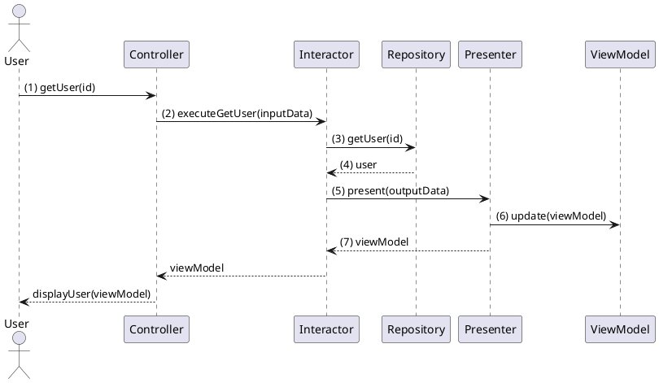

# Clean Architecture Example in TypeScript

This README provides an in-depth explanation of a TypeScript code example that demonstrates the Clean Architecture principles. Clean Architecture is a software design philosophy that organizes software into layers with a dependency rule. This rule ensures that dependencies point inward towards the use cases and entities, making the software more maintainable and adaptable to changes.

## Table of Contents

- [Clean Architecture Example in TypeScript](#clean-architecture-example-in-typescript)
  - [Table of Contents](#table-of-contents)
  - [Introduction](#introduction)
  - [Requirements and Installation](#requirements-and-installation)
  - [Running the Example](#running-the-example)
  - [Project Structure](#project-structure)
  - [Architecture Overview](#architecture-overview)
    - [Entities](#entities)
      - [User](#user)
    - [Use Cases](#use-cases)
      - [Interactor](#interactor)
    - [Interface Adapters](#interface-adapters)
      - [Controller](#controller)
      - [Presenter](#presenter)
      - [Repository](#repository)
    - [Frameworks and Drivers](#frameworks-and-drivers)
      - [Database](#database)
    - [Crossing Boundaries](#crossing-boundaries)
      - [I/O Data](#io-data)
      - [View Model](#view-model)
  - [Conclusion](#conclusion)

## Introduction

Please note that the content of this document is based on Chapter 22 of "The Clean Architecture" book by Robert C. Martin. The TypeScript code example that follows is structured according to the typical scenario diagram illustrated in Figure 22.2 of the aforementioned book.

## Requirements and Installation

This example requires Node.js and TypeScript to be installed on your machine. To install the dependencies, simply run:

```sh
npm install
```

## Running the Example

To run the example, compile the TypeScript code and execute the resulting JavaScript using Node.js, like so:

```sh
tsc && node main.js
```

## Project Structure

The project is organized into the following folder structure:

```plaintext
my-project/
├── entities/
│   └── user.ts
├── framework-and-drivers/
│   └── database.ts
├── interface-adapters/
│   ├── controller.ts
│   ├── interfaces/
│   │   ├── database.interface.ts
│   │   ├── interactor.interface.ts
│   │   ├── presenter.interface.ts
│   │   ├── view-model.ts
│   │   └── repository.interface.ts
│   ├── presenter.ts
│   └── repository.ts
├── use-cases/
│   ├── input-data.ts
│   ├── interactor.ts
│   ├── interfaces/
│   │   ├── interactor.interface.ts
│   │   ├── presenter.interface.ts
│   │   └── repository.interface.ts
│   └── output-data.ts
└── main.ts
```

- `entities`: Contains the `User` class.
- `use-cases`: Contains the Interactor, InputData, and OutputData classes.
- `interface-adapters`: Contains the Controller, Presenter, ViewModel, and Repository classes, as well as interfaces for adapters.
- `framework-and-drivers`: Contains concrete implementations such as the mock Database class.
- The root folder also includes the `main.ts` file, which demonstrates the usage of the components in a simple application flow.

## Architecture Overview

The following shows a typical scenario for a web-based Typescript system using
a database. 




The diagram depicts a data-fetching process in a web-based TypeScript system with a database:

1. **User**: Initiates action (e.g., fetching a user), which is handled by the **Controller** (`interface-adapters/controller.ts`).

2. **Controller**: Packages input into `InputData` (`use-cases/input-data.ts`) and sends it to the **Interactor**.

3. **Interactor** (`use-cases/interactor.ts`): Processes input data, controls interaction between entities and **Repository** for data retrieval/storage.

4. **Repository** (`interface-adapters/repository.ts`): Manages data persistence, communicating with an in-memory **Database** (`framework-and-drivers/database.ts`).

5. **Interactor**: Creates an `OutputData` object (`use-cases/output-data.ts`) with retrieved data and passes it to **Presenter**.

6. **Presenter** (`interface-adapters/presenter.ts`): Converts output data into a **ViewModel** (`interface-adapters/interfaces/view-model.ts`) for display.

7. Application displays formatted data to the user through the View.


### Entities

#### User

The User entity is a simple class representing a user in the system. It includes properties for the user's ID, username, and password. It can be found in the `entities` directory, within the `user.ts` file.

```typescript
class User {
  constructor(public id: string, public username: string, public password: string) {}
}
```

### Use Cases

#### Interactor

The Interactor is responsible for coordinating communication between the application's use cases and its data sources. In this example, the Interactor can be found in the `use-cases` directory, within the `interactor.ts` file. The Interactor communicates with the Repository to fetch and store User data and the Presenter to present the output data.

```typescript
// interactor.ts
class Interactor implements InteractorInterface {
  constructor(private userRepository: RepositoryInterface, private presenter: PresenterInterface) {}

  executeGetUser(inputData: InputData): void {
    // ...
  }

  executeCreateUser(inputData: InputData): void {
    // ...
  }
}
```

### Interface Adapters

#### Controller

The Controller is responsible for handling user input and delegating tasks to the Interactor. It can be found in the `interface-adapters` directory, within the `controller.ts` file.

```typescript
// controller.ts
class Controller {
  constructor(private interactor: InteractorInterface) {}

  getUser(id: string): void {
    // ...
  }

  createUser(id: string, username: string): void {
    // ...
  }
}
```

#### Presenter

The Presenter is responsible for presenting the output data resulting from the use cases. It can be found in the `interface-adapters` directory, within the `presenter.ts` file.

```typescript
// presenter.ts
class Presenter implements PresenterInterface {
  constructor(private viewModel: ViewModel) {}

  present(outputData: OutputData): void {
    // ...
  }
}
```

#### Repository

The Repository is responsible for providing an interface for data persistence, allowing the use cases to interact with data sources (such as a database) while keeping them decoupled from the specific implementation details of those data sources. The Repository can be found in the `interface-adapters` directory, within the `repository.ts` file.

```typescript
// repository.ts
class Repository implements RepositoryInterface {
  constructor(private database: DatabaseInterface<User>) {}

  getUser(id: string): User {
    // ...
  }

  createUser(user: User): void {
    // ...
  }
}
```

### Frameworks and Drivers

#### Database

The database is the implementation of the data persistence used in this example. It simulates a simple in-memory database, storing data as a JavaScript array. The database implementation can be found in the `framework-and-drivers` directory, within the `database.ts` file.

```typescript
// database.ts
class Database<T> implements DatabaseInterface<T> {
  private items: T[] = [];

  get(id: string): T {
    // ...
  }

  create(item: T): void {
    // ...
  }
}
```

### Crossing Boundaries

Crossing boundaries in Clean Architecture means passing data through different layers (e.g., from use cases to interface adapters). In this example, this is demonstrated via the use of InputData, OutputData, and ViewModel classes.

When the Controller receives user input, it creates an instance of InputData, populates it with the necessary information, and passes it to the Interactor. The Interactor communicates with the Repository to fetch/store data, creates an instance of OutputData, and passes it to the Presenter. The Presenter then updates the ViewModel with the relevant information from the OutputData. The original data crosses multiple boundaries, being transformed along the way to ensure separation of concerns and decoupling between layers.

#### I/O Data

Input and Output Data classes are used to pass data between boundaries. In this example, these data classes can be found in the `use-cases` directory:

`input-data.ts`: Handles input data to the Interactor.

```typescript
// input-data.ts
class InputData {
  constructor(public id: string, public username?: string) {}
}
```

`output-data.ts`: Handles output data that comes as a result of the use cases.

```typescript
// input-data.ts
class OutputData {
  constructor(public id: string, public username: string) {}
}
```

#### View Model

The View Model is used as an intermediate data structure between the Presenter and the View. In this example, the View Model is a simple interface with optional properties for the user's ID and username. It can be found in the `interface-adapters/interfaces` directory, within the `view-model.ts` file.

```typescript
// view-model.ts
class ViewModel {
  constructor(public id: string, public username?: string) {}
```

## Conclusion

This TypeScript example demonstrates the principles of Clean Architecture by structuring the code into distinct layers and adhering to the dependency rule. By following these principles, the codebase becomes more maintainable, testable, and adaptable to changes, making it a solid foundation for the growth of the application.