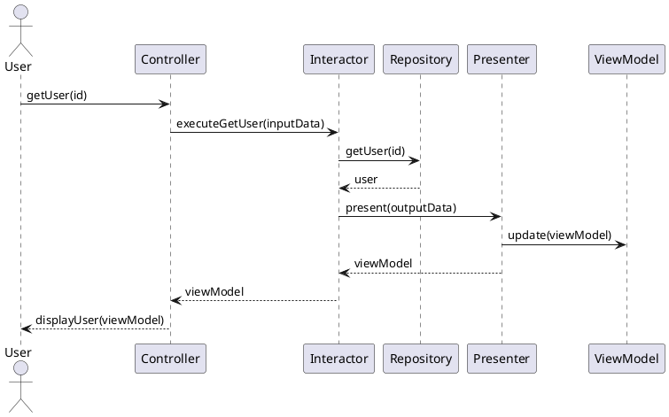
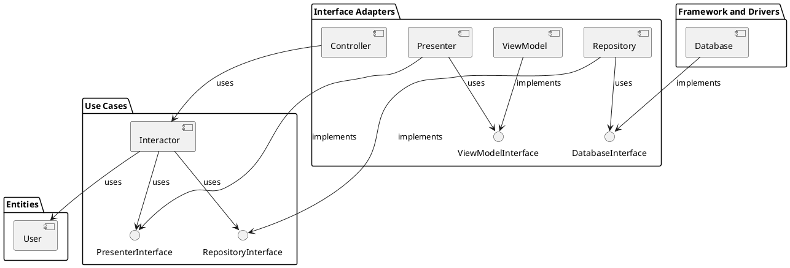

# Clean Architecture Example in TypeScript

This README provides an in-depth explanation of a TypeScript code example that demonstrates the Clean Architecture principles. Clean Architecture is a software design philosophy that organizes software into layers with a dependency rule. This rule ensures that dependencies point inward towards the use cases and entities, making the software more maintainable and adaptable to changes.

## Table of Contents

- [Clean Architecture Example in TypeScript](#clean-architecture-example-in-typescript)
  - [Table of Contents](#table-of-contents)
  - [Introduction](#introduction)
  - [Requirements and Installation](#requirements-and-installation)
  - [Running the Example](#running-the-example)
  - [Process Overview](#process-overview)
  - [Architecture Overview](#architecture-overview)
  - [Folder Structure](#folder-structure)
    - [Entities](#entities)
      - [User](#user)
    - [Use Cases](#use-cases)
      - [Interactor](#interactor)
    - [Interface Adapters](#interface-adapters)
      - [Controller](#controller)
      - [Presenter](#presenter)
      - [Repository](#repository)
    - [Frameworks and Drivers](#frameworks-and-drivers)
      - [Database](#database)
    - [Crossing Boundaries](#crossing-boundaries)
      - [I/O Data](#io-data)
      - [View Model](#view-model)
  - [Conclusion](#conclusion)

## Introduction

The main concept of this document is based on "Clean Architecture: A Craftsman's Guide to Software Structure and Design" book by Robert C. Martin.

The Clean Architecture concept aims to achieve separation of concerns by dividing the software application into layers. These layers help in isolating business rules, UI, database, and external agencies from each other. This separation is intended to make the system more understandable, flexible, and maintainable. The primary focus is on the use of a domain-centric architecture where the domain logic is at the core and is independent of external concerns like databases and frameworks.

## Requirements and Installation

This example requires Node.js and TypeScript to be installed on your machine. To install the dependencies, simply run:

```sh
npm install
```

## Running the Example

To run the example, compile the TypeScript code and execute the resulting JavaScript using Node.js, like so:

```sh
tsc && node main.js
```

## Process Overview

The process starts with the web server, which collects input data from the user and transfers it to the Controller. The Controller encapsulates this data into a conventional object, which is then routed through the InputData to the Interactor.

The Interactor deciphers this data, employing it to choreograph the movements of the Entities. Simultaneously, it harnesses the Repository to retrieve the data necessary for these Entities from the Database, loading it into memory. Upon completion, the Interactor amasses data from the Entities and shapes the OutputData into another unadorned object. This OutputData is subsequently passed through the OutputBoundary interface to the Presenter.

The key responsibility of the Presenter is to reformat the OutputData into a viewable form as the ViewModel, which takes the form of yet another plain object. The ViewModel primarily comprises Strings and flags that the View employs to exhibit the data. While the OutputData might include Date objects, the Presenter populates the ViewModel with corresponding Strings already properly formatted for the user. 

Consequently, the View is left with the simple task of transferring the data from the ViewModel into the HTML page.

Interaction Diagram:


*The above diagram illustrates the flow of data between the components for a single use case.*

## Architecture Overview

The project showcases an architecture that is divided into four layers:

1. Entities
2. Use Cases
3. Interface Adapters
4. Frameworks and Drivers

These layers help isolate each concern and create a clear separation between business rules, UI, database, and external agencies. This separation results in a more understandable, flexible, and maintainable system.

1. **Entities** represent the domain objects in the system, such as the `User` class.
2. **Use Cases** define the application's main actions and coordinate communication between entities and interface adapters. The `Interactor` orchestrates these actions and dependencies.
3. **Interface Adapters** act as the bridge between the core business logic and the technologies used in the application. This layer comprises the `Controller`, which processes user input, alongside the `Repository` for data persistence, and the `Presenter` for displaying output data.
4. **Frameworks and Drivers** implement the technological aspects of the system, such as the `Database` class, which provides a simple in-memory data store.

The following diagram illustrates the dependencies between the layers:


*Take note of the directions of the dependencies. All dependencies traverse the boundary lines, directing inward, adhering to the Dependency Rule.*

## Folder Structure

The project is organized into the following folder structure:

```plaintext
my-project/
├── entities/
│   └── user.ts
├── framework-and-drivers/
│   └── database.ts
├── interface-adapters/
│   ├── controller.ts
│   ├── interfaces/
│   │   ├── database.interface.ts
│   │   ├── interactor.interface.ts
│   │   ├── presenter.interface.ts
│   │   ├── view-model.ts
│   │   └── repository.interface.ts
│   ├── presenter.ts
│   └── repository.ts
├── use-cases/
│   ├── input-data.ts
│   ├── interactor.ts
│   ├── interfaces/
│   │   ├── interactor.interface.ts
│   │   ├── presenter.interface.ts
│   │   └── repository.interface.ts
│   └── output-data.ts
└── main.ts
```
*Note that the `interfaces` folder is included in each layer, as it is used to define the interfaces for the adapters.*

The folders are organized as follows:

- `entities`: Contains the `User` class.
- `use-cases`: Contains the Interactor, InputData, and OutputData classes.
- `interface-adapters`: Contains the Controller, Presenter, ViewModel, and Repository classes, as well as interfaces for adapters.
- `framework-and-drivers`: Contains concrete implementations such as the mock Database class.
- The root folder also includes the `main.ts` file, which demonstrates the usage of the components in a simple application flow.


### Entities

#### User

The User entity is a simple class representing a user in the system. It includes properties for the user's ID, username, and password. It can be found in the `entities` directory, within the `user.ts` file.

```typescript
class User {
  constructor(public id: string, public username: string, public password: string) {}
}
```

### Use Cases

#### Interactor

The Interactor is responsible for coordinating communication between the application's use cases and its data sources. In this example, the Interactor can be found in the `use-cases` directory, within the `interactor.ts` file. The Interactor communicates with the Repository to fetch and store User data and the Presenter to present the output data.

```typescript
// interactor.ts
class Interactor implements InteractorInterface {
  constructor(private userRepository: RepositoryInterface, private presenter: PresenterInterface) {}

  executeGetUser(inputData: InputData): void {
    // ...
  }

  executeCreateUser(inputData: InputData): void {
    // ...
  }
}
```

### Interface Adapters

#### Controller

The Controller is responsible for handling user input and delegating tasks to the Interactor. It can be found in the `interface-adapters` directory, within the `controller.ts` file.

```typescript
// controller.ts
class Controller {
  constructor(private interactor: InteractorInterface) {}

  getUser(id: string): void {
    // ...
  }

  createUser(id: string, username: string): void {
    // ...
  }
}
```

#### Presenter

The Presenter is responsible for presenting the output data resulting from the use cases. It can be found in the `interface-adapters` directory, within the `presenter.ts` file.

```typescript
// presenter.ts
class Presenter implements PresenterInterface {
  constructor(private viewModel: ViewModel) {}

  present(outputData: OutputData): void {
    // ...
  }
}
```

#### Repository

The Repository is responsible for providing an interface for data persistence, allowing the use cases to interact with data sources (such as a database) while keeping them decoupled from the specific implementation details of those data sources. The Repository can be found in the `interface-adapters` directory, within the `repository.ts` file.

```typescript
// repository.ts
class Repository implements RepositoryInterface {
  constructor(private database: DatabaseInterface<User>) {}

  getUser(id: string): User {
    // ...
  }

  createUser(user: User): void {
    // ...
  }
}
```

### Frameworks and Drivers

#### Database

The database is the implementation of the data persistence used in this example. It simulates a simple in-memory database, storing data as a JavaScript array. The database implementation can be found in the `framework-and-drivers` directory, within the `database.ts` file.

```typescript
// database.ts
class Database<T> implements DatabaseInterface<T> {
  private items: T[] = [];

  get(id: string): T {
    // ...
  }

  create(item: T): void {
    // ...
  }
}
```

### Crossing Boundaries

Crossing boundaries in Clean Architecture means passing data through different layers (e.g., from use cases to interface adapters). In this example, this is demonstrated via the use of InputData, OutputData, and ViewModel classes.

When the Controller receives user input, it creates an instance of InputData, populates it with the necessary information, and passes it to the Interactor. The Interactor communicates with the Repository to fetch/store data, creates an instance of OutputData, and passes it to the Presenter. The Presenter then updates the ViewModel with the relevant information from the OutputData. The original data crosses multiple boundaries, being transformed along the way to ensure separation of concerns and decoupling between layers.

#### I/O Data

Input and Output Data classes are used to pass data between boundaries. In this example, these data classes can be found in the `use-cases` directory:

`input-data.ts`: Handles input data to the Interactor.

```typescript
// input-data.ts
class InputData {
  constructor(public id: string, public username?: string) {}
}
```

`output-data.ts`: Handles output data that comes as a result of the use cases.

```typescript
// input-data.ts
class OutputData {
  constructor(public id: string, public username: string) {}
}
```

#### View Model

The View Model is used as an intermediate data structure between the Presenter and the View. In this example, the View Model is a simple interface with optional properties for the user's ID and username. It can be found in the `interface-adapters/interfaces` directory, within the `view-model.ts` file.

```typescript
// view-model.ts
class ViewModel {
  constructor(public id: string, public username?: string) {}
```

## Conclusion

This TypeScript example demonstrates the principles of Clean Architecture by structuring the code into distinct layers and adhering to the dependency rule. By following these principles, the codebase becomes more maintainable, testable, and adaptable to changes, making it a solid foundation for the growth of the application.